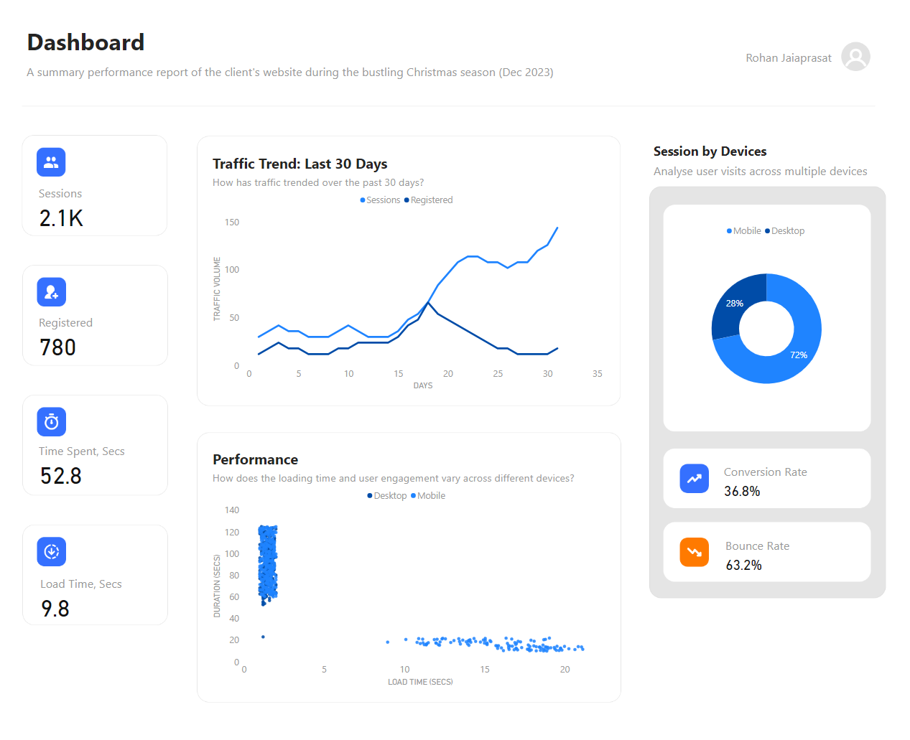

# Optimise E-Commerce Conversion

### Abstract

This project aims to enhance e-commerce conversion rates through meticulous data analysis. A range of analytical tools, including SQL, MySQL, and Power BI, were employed to dissect website performance, user behaviour patterns, and conversion drivers. Despite increased traffic, the conversion rate fell short of expectations, prompting an in-depth investigation. Insights highlighted issues with platform responsiveness and load time, particularly on mobile devices, negatively impacting user engagement. Recommendations include implementing responsive design and optimising site content and assets to reduce load time. These enhancements are anticipated to improve user experience and drive higher conversion.

### Keywords
SQL, MySQL, MySQL Benchmark, Power BI Desktop, Excel, ETL (Extract, Transform, Load), PowerQuery, DAX, M-Language, Data Collection, Data Wrangling, Data Modelling, Visualisation, Presentation, Storytelling, Critical Thinking, Problem-solving, Analytics, Project Management, Continous Learning, Star Schema, SCQA Framework, MySQL Benchmark, Web Analytics.  

## Problem Statement

In anticipation of the bustling Christmas season of 2023, a determined entrepreneur initiated a trial deployment of their website. Despite witnessing a surge in traffic, the conversion rate for registration fell below expectations, leading to a modest customer base. The entrepreneur is seeking to gain insights into the website's performance and discern actionable strategies for enhancement.

## Project Objectives & Scope

**Traffic Analysis:**  Assess the website's performance throughout December 2023, analysing crucial metrics including sessions, registrations, conversion rates, and bounce rates. Identify trends to understand user behaviour and engagement patterns.

**Identify Factors Impacted Registration:** Investigate the underlying reasons for the low conversion rate despite the considerable influx of traffic.

## Deliverables

**Dashboard Report:** Develop an interactive dashboard providing real-time analytics and performance metrics. The dashboard will offer insights into session trends, and conversion rates, enabling informed decision-making.

<a href="https://drive.google.com/file/d/1GnIiaLeq_bj8tY88jUNc9xakdRAknv_i/view?usp=sharing" target="__blank">Access & Download Dashboard</a>

**Storytelling Presentation:** Create an engaging presentation summarising key insights and recommendations to entrepreneur. The presentation will highlight actionable strategies derived from data analysis to enhance the website's performance and increase conversion rates.

<a href="https://docs.google.com/presentation/d/16wNspvvbP7YRqfwWD-3fkocJ_WPxgpVO/edit?usp=drive_link&ouid=115869707834917525849&rtpof=true&sd=true" target="_blank">Access & Download Final Presentation</a>

<a href="https://drive.google.com/file/d/1od-HZx0lh_RXJrQSAg2MQMxo5HVHzOHi/view?usp=sharing" target="_blank">Access & Download PDF version</a>

## Tools & Technologies

+ **SQL & MySQL** - Conducted data manipulation, transformation, and modelling to extract insights.
+ **Excel** - Constructed visual repesentations, such as charts and graphs to illustrate data trends and patterns.
+ **Figma** - Designed dashboard mockup to visualise the layout, colour scheme, and components before implementation.
+ **PowerBI Desktop** - Created interactive dashboard for presenting key findings.
+ **PowerPoint** - Formulated presentation to impart data insights in an engaging and comprehensible manner (storytelling).

## Explore detailed chapters on the data analysis process
1. <a href="./stages/1.prepare/">Data Collection</a>
2. <a href="./stages/2.clean/">Data Cleaning & Wrangling</a>
3. <a href="./stages/3.model/">Data Modelling</a>
4. <a href="./stages/4.analyse/">Analysis I, II & Visuals</a>
5. <a href="./stages/5.visual/">Visualisation (Dashboard)</a>

## Insights & So What?

Several critical insights have emerged regarding the website's performance. Data indicates a peak in session numbers by mid-December, continuing to rise until the end of the month. Despite this heightened activity, registration rates remained disappointingly low. Further investigation revealed a disparity in conversion rates between desktop and mobile users, primarily attributed to slower loading times on mobile devices, ranging between 15-30 seconds. 

Analysis demonstrated a significant correlation between load time and user engagement, with longer load times resulting in increased user abandonment. Experts and developers recommend a loading time of less than 10 seconds for optimal experience.

In light of these findings, prioritising responsive website design and optimising content across platforms is essential. Implementing responsive design techniques to seamlessly adapt to various screen sizes and resolutions is recommended. Additionally, efforts should be made to optimise images, scripts, and other elements to reduce load time and minimise hardware resource usage. Continuous monitoring and regular audits across different devices are imperative. Acquiring user feedback and conducting A/B testing are additional crucial steps for enhancing user experience and maximising conversion.

## Data Limitations

+ The dataset lacks information regarding user interactions with specific pages, such as the homepage, registration form, and contact page. Understanding the performance of individual pages is essential for identifying areas for improvement and optimising the user journey.

+ It provides limited insights into user behaviour, including session duration, bounce rate, and conversion rate. More detailed metrics, such as unique sessions, and returning visitors, offer deeper insights into user engagement and conversion funnel analysis.

+ There is a lack of information on the browsers used by visitors. Analyzing browser data can highlight compatibility issues and guide efforts to optimise responsive design.

+  The sources of website traffic and geographic regions are unclear. Understanding the origin of traffic can help refine marketing strategies (CPC, CTR, CPM, etc.) and allocate resources (server host).

+ Demographic data on website visitors, such as age, gender, or interests, is missing. Understanding the demographic profile can aid in tailoring site content.

## Project Limitation
+ The project scope is limited to analysing website performance during a specific trial period (December 2023), which may not capture long-term trends or seasonal variations in consumer behavior. 

+ The project may implicitly assume causality between observed metrics (e.g., low conversion rates and slow loading times on mobile devices) without conducting rigorous causal inference analysis. Correlation does not necessarily imply causation, and further causal analysis may be needed to validate assumptions.

+ There is a limited feedback loop for continuous improvements. Integrating feedback mechanisms such as surveys, usability testing, or customer reviews can provide valuable insights for refining website features.

+ The analysis primarily focuses on internal website metrics and performance without considering external factors such as market trends, competitor actions, or economic conditions. 

+ The data used for analysis may not represent the entire population of website visitors, as it only includes those who interacted with the website during the specified trial period. Visitors who did not engage with the website or those from underrepresented demographic groups are not accounted for.